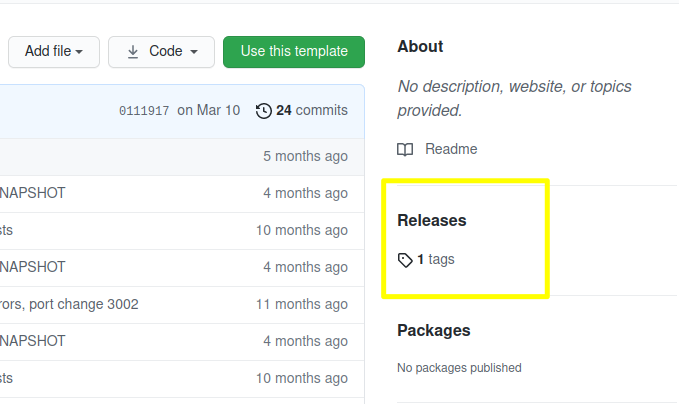
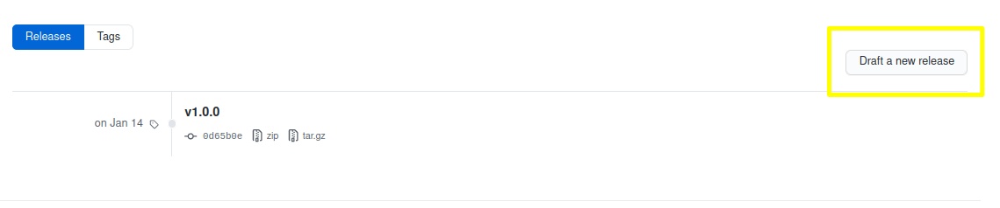
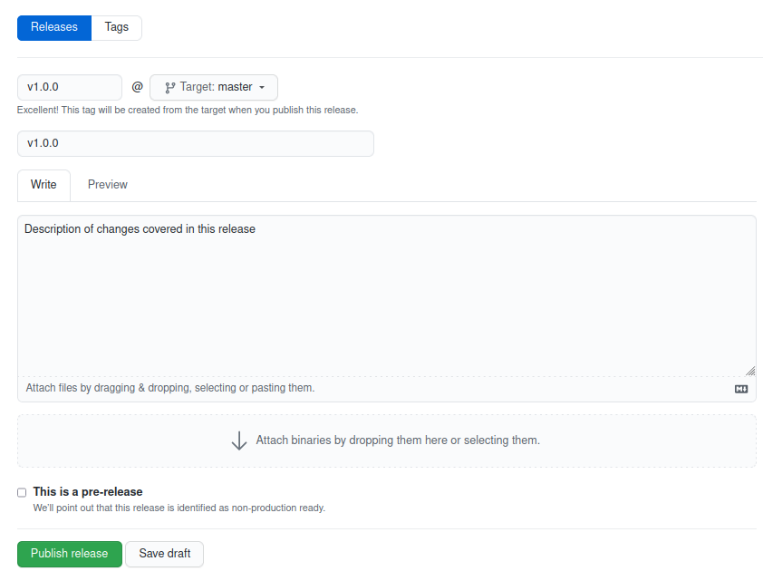
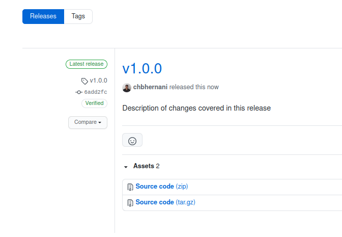

# PM4ML Core Connector REST Template

Template project for Mojaloop connector for a core banking system.

**Technologies**
- [Apache Camel](https://camel.apache.org/)
- [Apache CXF](https://cxf.apache.org)
- [Apache Maven](https://maven.apache.org/)
- [DataSonnet](https://datasonnet.s3-us-west-2.amazonaws.com/docs-ci/primary/master/datasonnet/1.0-SNAPSHOT/index.html)
- [Spring Boot](https://spring.io/projects/spring-boot)
- [Swagger](https://swagger.io/)
- [OpenAPI Generator Maven Plugin](https://github.com/OpenAPITools/openapi-generator/tree/master/modules/openapi-generator-maven-plugin)
- [Prometheus JVM Client](https://github.com/prometheus/client_java)

On copy this template project, rename the project name in following places:
>TODO: add places where project name must be renamed

## Local development

To generate the Java Rest DSL router and Model files (in parent pom): 
```sh
mvn clean install
```

To build the project: 
```sh
mvn clean package
```

To run the Java application, first run the Maven build and then Java jarfile:
```sh
$ java -jar ./core-connector/target/core-connector-{{version}}.jar
```

Or to run the Java application from Intellij IDE, add the configuration for `Run/Debug`.
> TODO:   
> add new topic how to run application from Intellij  
> add new topic how to debug application from Intellij  
> add new topic to cover patterns followed for the Core Connector development (Apache Camel, Datasonnet, Logging, etc...)

### Overwrite application properties
**NOTE:** Each Core Connector project has its own set of credentials to be declared at runtime. So please check the repo has the additional information on this regard. 

:warning: **IMPORTANT:** don't commit the `application.yaml` containing sensitive information. :warning:

To run Java application and set custom system property will enable to overwrite values from `application.yaml`.
```sh
$ java -Dml-conn.outbound.host=http://simulator:4001 -jar ./core-connector/core-connector-{{version}}.jar
```

### Run Mojaloop Simulator
To enable backend connection test, run `mojaloop-simulator-backend` before run connector.
```sh
$ docker run --rm -p 3000:3000 mojaloop-simulator-backend:latest
```

### Docker Image

> TODO: describe the Dockerfile variables usage  

To build a new Docker image based on Dockerfile.
```sh
$ docker build -t mojaloop-core-connector:latest .
```

To run the Docker image:
```sh
docker run -p 3000:3000 -p 8080:8080 -t core-connector
```

To run the Docker image overwriting the application properties, set the environment variable as per listed into Dockerfile. The pattern to set Docker environment variables is CAPITAL_UNDERSCORE.
```sh
$ docker run --rm -e BACKEND_ENDPOINT=http://simulator:3000 -e MLCONN_OUTBOUND_ENDPOINT=http://simulator:3003 -p 3002:3002 mojaloop-simulator-core-connector:latest
```

To run the Integration Tests (run mvn clean install under core-connector folder first):
```sh
mvn -P docker-it clean install
```

### Prometheus local client
To enable testing Prometheus client implementation in local environment, follow the below steps.

#### Prometheus Docker
1. Create a folder for Prometheus Docker volume
```shell script
$ mkdir -p /docker/prometheus
```

2. Under created folder, create a `prometheus.yml` configuration file with below content.
```shell script
global:
  scrape_interval:  10s # By default, scrape targets every 15 seconds.
  evaluation_interval: 10s # By default, evaluate rules every 15 seconds.

# A scrape configuration containing exactly one endpoint to scrape:
# Here it's Prometheus itself.
scrape_configs:
  # The job name is added as a label `job=<job_name>` to any timeseries scraped from this config.
  - job_name: 'prometheus'
  
  # metrics_path defaults to '/metrics'
  #    scheme defaults to 'http'.
    static_configs:
    - targets: ['localhost:7001'] # Might be the local IP  
```

3. Start Docker container binding configuration file.
```shell script
docker run -d -p9090:9090 --name prometheus -v /path/to/file/prometheus.yml:/etc/prometheus/prometheus.yml prom/prometheus
```
**NOTE:** Running above command once it is possible do `docker stop prometheus` to disable service and `docker start prometheus` to enable it again.
Rather than that add `--rm` flag to destroy Docker container whenever it is stopped.

4. Once Docker is running, access Prometheus by browser in [localhost:9090](localhost:9090).
   Check configurations is like expected in [/config](localhost:9090/config) and [/targets](localhost:9090/targets).

5. In *Graph* page, Expression field, add the metric key expected to monitor according set for application client and press Execute.

**NOTE:** The list of metric keys can be found `metrics_path` set under `scrape_configs` of `prometheus.yml` file (Ex: [localhost:7001/metrics](localhost:7001/metrics)).

#### Prometheus Java Client

To enable Prometheus metrics it is following steps and samples from [prometheus/client_java](https://github.com/prometheus/client_java).
The types of metrics enabled are _Counter_ and _Histogram_ and the default port set for exporter is 7001,
but it can be changed in `application.yml` property `server.metrics.port`.

## Deployment

### Setup CircleCI pipeline
>TODO: add screenshots

Before release a new version of core connector project, it is good setup CircleCI pipeline.
There is a template of `config.yml` file under `.circleci` directory. Usually it doesn't require any change.
The existing configuration file sets to:
 - Package a JAR file by Maven build.
 - Build a Docker container image based on project Dockerfile for the application JAR file.
 - Push the Docker container image to its repository.
 - Trigger all the above steps only on Git tag (GitHub Release).
Follow the below steps to setup the CircleCI pipeline:
1. Access the organization [CircleCI](https://app.circleci.com/pipelines/github/pm4ml). 
   Use **Log In with GitHub** option on Sing In. 
1. On **Projects** menu, look for the core connector project and press to **Set Up Project**.
1. On select a `config.yml` file dialog box, check the option for existent `.circleci/config.yml` in repo and sign it to `master` branch. Press to continue to the project dashboard.
1. Press the **Project Settings** button and select **Environment Variables** menu. Press to **Import Variables**, select any other core connector project and confirm the import action.
1. Now the CircleCI pipeline should be able to be triggered once GitHub project receive a [new release/tag](#release-core-connector-image).

### Release Core Connector image

1. Ensure the Dockerfile is up-to-date.
2. The project has a CircleCI pipeline that will take care to publish the docker file to the registry.  
This Pipeline is triggered on Git `tag` moment, so go ahead use the **Releases** option on GitHub to create the new release version which will generate the tag.
Keep the Semantic Versioning format creating a new tag, like `vM.m.p` (Ex: v1.0.0 - the *v* **MUST TO BE** lowercase).
    - GiHub Releases
        
        
        
        
    - Git command line
        ```
        git tag -a v1.0.0 -m "v1.0.0"
        git push --follow-tags
        ```

3. Check CircleCI pipeline ran successfully on [CircleCI](https://app.circleci.com/pipelines/github/pm4ml). 
PS: going to be updated to GitHub Actions

4. Check the image was published properly into [DockerHub](https://hub.docker.com/u/pm4ml).

### GitLab Deployment

> **Prerequisites**
>- Access to GitLab project.

>TODO: add screenshots

The PM4ML environments are deployed by GitLab pipelines. To be able to update and run it, check which is the proper GitLab project for the core connector is going to be updated.

#### Deploying a new Core Connector release (image) version

1. Edit *k3s-sync-dir/static.pm4ml.values.yaml* file and look for `mojaloop-core-connector` entry. Update `image` and `env` entries according the core connector project you want to deploy.

2. Commit to `master` branch or open a `Merge Request` to request for change approval.

3. Go to `CI/CD` menu and select `Pipelines`. Usually the first pipeline is about the last change done. Select it and press play to run `Install PM4MLs` job under `Deploy PM4MLs` pipeline.

4. Check the pipeline finish success and proceed to [validation step](#validate-pm4ml-helm-deployment).

### Validate PM4ML Helm deployment

> Prerequisites
> - aws cli
> - kubectl
> - Postman
> - Access to the S3 Bucket of the environment

1. Sync the S3 Bucket files
```sh
rm -rf ./mmd_thitsaworks_uat_s3; \
mkdir ./mmd_thitsaworks_uat_s3; \
aws s3 sync s3://pre-mojaloop-state/thitsaworks-uat/ ./mmd_thitsaworks_uat_s3
```

2. Connect to the environment VPN with the provided Wireguard profile file and check the status of connection.
```sh
sudo wg-quick up ./thitsa-uat.conf
sudo wg
```

3. Export the KUBECONFIG to the downloaded config file from S3 Bucket to enable connect to the pods.
```sh
export KUBECONFIG=path/to/mmd_thitsaworks_uat_s3/kubeconfig
```

4. List the pods from proper namespace to get the core connector pod name.
```sh
kubectl get pods -n thitsaworks
```

5. Open the core connector logs to follow the requests messages.
```sh
kubectl logs -f -n thitsaworks thitsaworks-mojaloop-core-connector-7fb769b4bc-qlbkf
```

6. Perform the requests against core connector environment URL and check the results (follow the logs if necessary).

7. Disconnect from the environment VPN and check the connection gone (empty command result).
```sh
sudo wg-quick down ./thitsa-uat.conf
sudo wg
```

## Notes
For version update, please follow the (Semver)[https://semver.org/#semantic-versioning-200] pattern.
