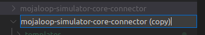
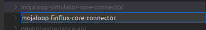
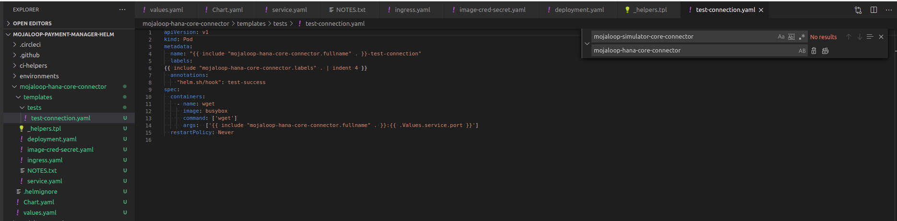
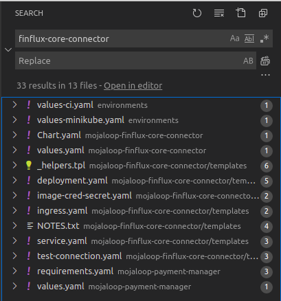
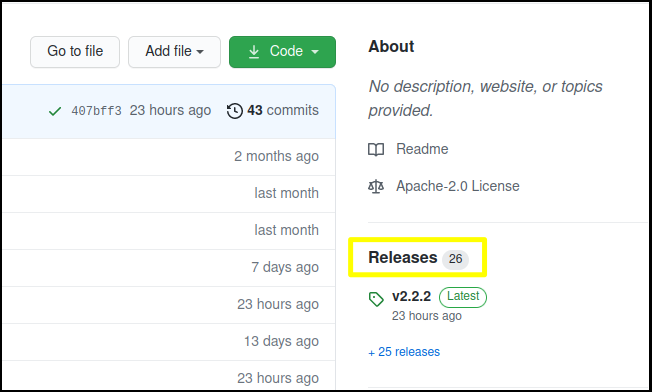
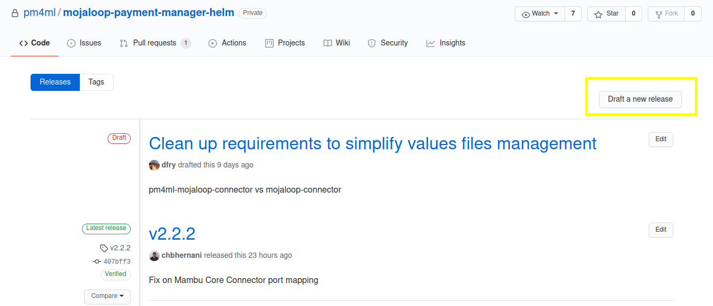
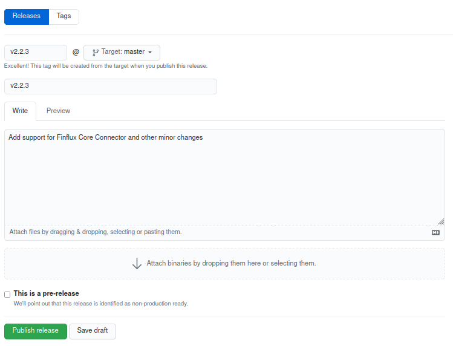
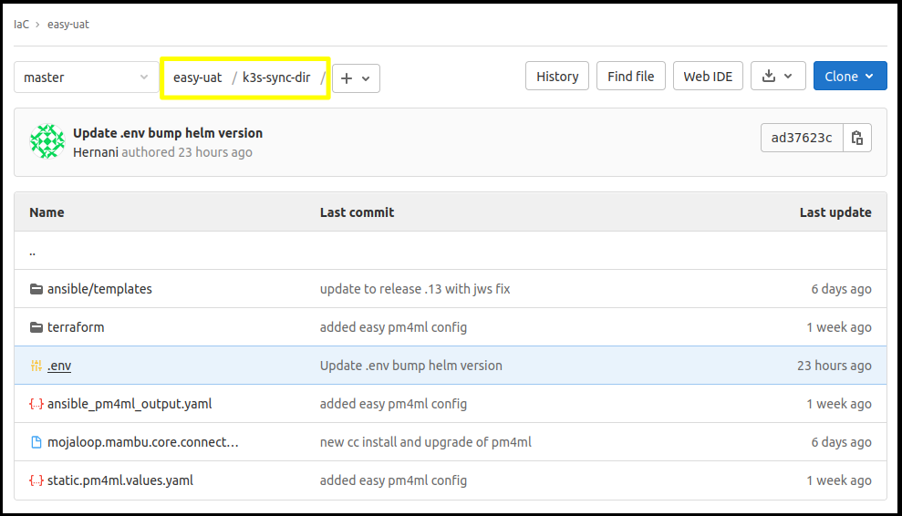

# PM4ML Core Connector REST Template

Template project for Mojaloop connector for a core banking system.

**Technologies**
- [Apache Camel](https://camel.apache.org/)
- [Apache CXF](https://cxf.apache.org)
- [Apache Maven](https://maven.apache.org/)
- [DataSonnet](https://datasonnet.s3-us-west-2.amazonaws.com/docs-ci/primary/master/datasonnet/1.0-SNAPSHOT/index.html)
- [Spring Boot](https://spring.io/projects/spring-boot)
- [Swagger](https://swagger.io/)
- [OpenAPI Generator Maven Plugin](https://github.com/OpenAPITools/openapi-generator/tree/master/modules/openapi-generator-maven-plugin)

## Local development

To generate the Java Rest DSL router and Model files (in parent pom): 
```sh
mvn clean install
```

To build the project: 
```sh
mvn clean package
```

To build the project using Docker: 
```sh
docker build -t client-adapter
```

To run the project using Docker: 
```sh
docker run -p 3000:3000 -p 8080:8080 -t client-adapter
```

To run the Integration Tests (run mvn clean install under client-adapter folder first):
```sh
mvn -P docker-it clean install
```

### Run with environment variable

Application **must** receive the BACKEND_ENDPOINT environment variable to connect to mojaloop-simulator.
```sh
$ java -Dbackend.endpoint=http://simulator:3000 -Doutbound.endpoint=http://simulator:3003 -jar ./client-adapter/target/client-adapter.jar
```
```sh
$ docker run --rm -e BACKEND_ENDPOINT=http://simulator:3000 -e MLCONN_OUTBOUND_ENDPOINT=http://simulator:3003 -p 3002:3002 mojaloop-simulator-core-connector:latest
```

### Run Mojaloop Simulator
To enable backend connection test, run `mojaloop-simulator-backend` before run connector.
```sh
$ docker run --rm -p 3000:3000 mojaloop-simulator-backend:latest
```

### Build Docker Image
To build a new Docker image based on Dockerfile.
```sh
$ docker build -t mojaloop-simulator-core-connector:latest .
```

## Release Core Connector image

1. Ensure the project has the updated Dockerfile.

1. The project has a CircleCI pipeline that will take care to publish the docker file to proper the repository.
To trigger the pipeline, create a new `tag` or use **Releases** on GitHub.
Keep the following pattern on create a new tag: `vM.m.p` (Ex: v1.0.0 **Important**: lowercase *v*).
    - GiHub Releases
        
        
        
        
    - Git command line
        ```
        git tag -a v1.0.0 -m "v1.0.0"
        git push --follow-tags
        ```

1. Check CircleCI pipeline ran successfully on [Modusbox CircleCI](https://app.circleci.com/pipelines/github/modusintegration).


1. Check the image was published properly into registry. The repository path can be checked into CircleCI project variable `DOCKER_REGISTRY`. The current registry is [Modusbox jFrog Artifactory](), 
repository `mbx-docker > modusintegration > [[project_name]]`.


## PM4ML Helm Chart

> **Prerequisites**
>- Access to [PM4ML Helm Chart project](https://github.com/pm4ml/mojaloop-payment-manager-helm).

To run in the infrastructure invironment, the core connectors must to be part of the [PM4ML Helm Chart](https://github.com/pm4ml/mojaloop-payment-manager-helm).

First, clone the PM4ML Helm Chart project. Then, follow the topic to [add](#adding-a-core-connector-chart) a new core core connector chart or to [update](#updating-a-core-connector-chart) the existent one. Finally, [deploy](#gitlab-deployment) the new chart version into the proper environment.

### Adding a core connector chart

If this is a new custom core connector implementation, the PM4ML Helm Chart project must to be updated to contemplate it.

To add a core connector chart copy an existent core connector chart folder or create the chart from the begining with helm commands (`helm create`).

Follow the below steps fits better the need:

#### a. Copying an existent chart folder

1. Under the root `mojaloop-payment-manager-helm` folder, find and copy the `mojaloop-simulator-core-connector` folder as template.Paste and rename it following the pattern like `mojaloop-[[fsp_name]]-core-connector`.



1. With help of a code editor, like VS Code, go through each file under the added chart folder and replace all the value `mojaloop-simulator-core-connector` to `mojaloop-[[fsp_name]]-core-connector`.


1. Change the properties of the below files to correspond to the added chart:

    1. `./mojaloop-[[fsp_name]]-core-connector/Chart.yaml`
        - **appVersion:** The core connector release number.
        - **version:** The Chart version. Since this is a new one set as `v1.0.0`.

    1. `./mojaloop-[[fsp_name]]-core-connector/values.yaml`
        - **image.repository:** URL to the core connector Docker image repository.
        - **image.tag:** The core connector release version.
        - **env:** It includes all the environment variables the core connector application is listen to. Since it was copied from another project maybe the standard variables is already set and no need to change the existent values. On add more variables, follow the pattern like `CAPITALIZE_UNDERSCORE`.
        - **service.port:** The port number the application is running into the container. The standard is `3003`.
    
    1. `./mojaloop-[[fsp_name]]-core-connector/templates/deployment.yaml`
        - **spec.template.spec.containers.env:** This is the place where the environment variables will be applied to the Docker image. If no new variable added no change is requested. If so, add a new block with `name` standing for the variable Docker image is listen to and `value` standing for reference for the variable set in the previous `values.yaml`. 

    1. `./environments/values-ci.yaml`
        - Find the block of code for `mojaloop-simulator-core-connector`, copy and paste it below the last core connector block and rename it to the new `mojaloop-[[fsp_name]]-core-connector`. If no new variable added no change is requested. If so, add the new variable and its value.

    1. `./environments/values-minikube.yaml`
        - Find the block of code for `mojaloop-simulator-core-connector`, copy and paste it below the last core connector block and rename it to the new `mojaloop-[[fsp_name]]-core-connector`. If no new variable added no change is requested. If so, add the new variable and its value.

    1. `./mojaloop-payment-manager/requirements.yaml`
        - Find the block of code for `mojaloop-simulator-core-connector`, copy and paste it below the last core connector block.
        - **name**: replace from `mojaloop-simulator-core-connector` to `mojaloop-[[fsp_name]]-core-connector`.
        - **version**: the same value set on `./mojaloop-[[fsp_name]]-core-connector/Chart.yaml` **version**.
        - **repository**: replace from `mojaloop-simulator-core-connector` to `mojaloop-[[fsp_name]]-core-connector`.
        - **condition**: replace from `mojaloop-simulator-core-connector` to `mojaloop-[[fsp_name]]-core-connector`.

    1. `./mojaloop-payment-manager/values.yaml`
        - Find the block of code for `mojaloop-simulator-core-connector`, copy and paste it below the last core connector block and rename it to the new `mojaloop-[[fsp_name]]-core-connector`. If no new variable added no change is requested. If so, add the new variable and its value.
        - **enabled**: set it to `false`.

    1. `./mojaloop-payment-manager/Chart.yaml`
        - Bump the values for **appVersion** and **version**.

    **NOTE:** After the above steps the total of files changed is usually around 13.
    

1. [Publish](#publishing-the-chart-changes) the chart changes.

#### b. Creating a new chart with `helm` commands

> **TODO**
> - add steps to this session

1. Follow https://helm.sh/docs/helm/helm_create/ instructions to create a new chart.

1. [Publish](#publishing-the-chart-changes) the chart changes.

### Updating a core connector chart

If the need is only to update or fix a core connector chart, change the properties of the below files to correspond to the updated chart:

1. `./mojaloop-[[fsp_name]]-core-connector/Chart.yaml`
    - **appVersion:** Update the core connector release number to the requested one.
    - **version:** Bump the Chart version.

1. `./mojaloop-[[fsp_name]]-core-connector/values.yaml`
    - **image.tag:** Update the core connector release number to the requested one.

1. `./mojaloop-payment-manager/Chart.yaml`
    - Bump the values for **appVersion** and **version**.

1. `./mojaloop-payment-manager/requirements.yaml`
    - Find the correspondent block of the core connector chart and update chart **version** for the updated number set for  `./mojaloop-[[fsp_name]]-core-connector/Chart.yaml` **version**.

1. Change any other file/properties requested.

1. [Publish](#publishing-the-chart-changes) the chart changes.

### Publishing the chart changes

With all the changes over PM4ML Heml Chart done:

1. Push the changes and open a new **Pull Request**.

1. Once the Pull Request is approved, **release** a new version of PM4ML Helm Chart project. Set the `Tag version` and `Release Title` to the same value specified into `mojaloop-payment-manager/Chart.yaml` **version** and give a little description what the new release is applying. In the end, press **Publish release**




## GitLab Deployment

> **Prerequisites**
>- Access to [GitLab project]() (check the proper one with the team).

The PM4ML environments are deployed by GitLab pipelines. To be able to update and run it, check which is the proper GitLab project for the core connector is going to be updated.

### Deploying a new PM4ML Helm Chart version

1. Edit *k3s-sync-dir/.env* file and update the `pm4ml_helm_version` property with the requested PM4ML chart release number.


1. Commit to `master` branch or open a `Merge Request` to request for change approval.

1. Run the `Install PM4MLs` pipeline job or ask for.

### Deploying a new Core Connector image version

1. Edit *k3s-sync-dir/.env* file and update the `pm4ml_helm_version` property with the requested PM4ML chart release number.

1. Commit to `master` branch or open a `Merge Request` to request for change approval.

1. Run the `Install PM4MLs` pipeline job or ask for.

### Validate PM4ML Helm deployment

<!-- #### a. VPN Access

Follow the instructions (here)[https://github.com/modusintegration/mmd-dev#vpn-access].

#### b. Kubernetes cluster config files

Follow the instructions (here)[https://github.com/modusintegration/mmd-dev#iac-configuration-file-access]. -->

> Prerequisites
> - aws cli
> - kubectl
> - Postman
> - Access to the S3 Bucket of the environment

1. Sync the S3 Bucket files
```sh
rm -rf ./mmd_thitsaworks_qa_s3; \
mkdir ./mmd_thitsaworks_qa_s3; \
aws s3 sync s3://pre-mojaloop-state/thitsaworks-qa/ ./mmd_thitsaworks_qa_s3
```

1. Connect to the environment VPN with the profile file got from S3 Bucket
```sh
sudo wg-quick up ./mmd_thitsaworks_qa_s3/wireguard.clients/client10.conf
sudo wg
```

1. Perform the requests against environment core connector URL using the shared Postman collection.

1. Disconnect from the environment VPN
```sh
sudo wg-quick down ./mmd_thitsaworks_qa_s3/wireguard.clients/client10.conf
sudo wg
```
## Notes
For version update, please follow the (Semver)[https://semver.org/#semantic-versioning-200] pattern.
