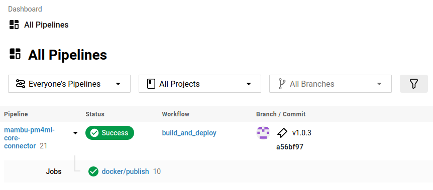
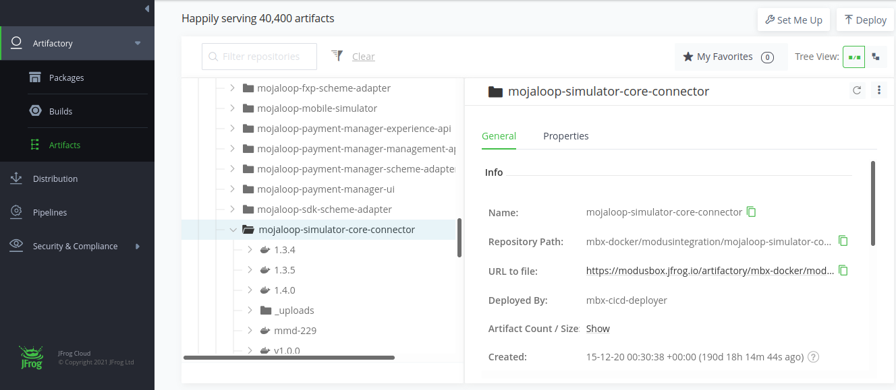

# PM4ML Core Connector REST Template

Sample project for a Mojaloop connector for a core banking system

>**TODO**
> - improve local development

## Local development

- To generate the Java Rest DSL router and Model files (In parent pom): 
```sh
mvn clean install
```

- To Build the Project: 
```sh
mvn clean package
```

- To Build the project using Docker: 
```sh
docker build -t client-adapter
```

- To run the project using Docker: 
```sh
docker run -p 3000:3000 -p 8080:8080 -t client-adapter
```

To run the Integration Tests (run mvn clean install under client-adapter folder first): `mvn -P docker-it clean install

## Release Core Connector

1. Ensure the project has the updated Dockerfile.

1. The project has a CircleCI pipeline that will take care to publish the docker file to proper the repository.
To trigger the pipeline, create a new `tag` or use **Releases** on GitHub.
Keep the following pattern on create a new tag: `vM.m.p` (Ex: v1.0.0 **Important**: lowercase *v*).
    - GiHub Releases
        
        
        
        
    - Git command line
        ```
        git tag -a v1.0.0 -m "v1.0.0"
        git push --follow-tags
        ```

1. Check CircleCI pipeline ran successfully on [Modusbox CircleCI](https://app.circleci.com/pipelines/github/modusintegration).


1. Check the image was published properly into registry. The repository path can be checked into CircleCI project variable `DOCKER_REGISTRY`. The current registry is [Modusbox jFrog Artifactory](), 
repository `mbx-docker > modusintegration > [[project_name]]`.


## PM4ML Helm

> **Prerequisites**
>- Access to [PM4ML Helm Chart project](https://github.com/pm4ml/mojaloop-payment-manager-helm).
>- Access to [GitLab project]() - check the proper one with the team.

> **TODO**
>-

The core connectors Helm Charts are part of [PM4ML Helm Chart project](https://github.com/pm4ml/mojaloop-payment-manager-helm).


### Adding a new core connector Helm

To add a new core connector Helm Chart, follow one of the options below:

#### a. Copying existent folder

1. Copy the `mojaloop-simulator-core-connector` folder as template and paste it renaming by the pattern `mojaloop-[[connector_name]]-core-connector`.

1. By VS Code (or any other), go through each file under the new folder, replace all `mojaloop-simulator-core-connector` value to `mojaloop-[[connector_name]]-core-connector`.

1. Change the files content to correspond to the added core connector:

    1. mojaloop-???-core-connector/Chart.yaml
        - **appVersion:** The Helm Chart project version. If it is new so it makes sense to be `v1.0.0`.
        - **version:** The core connector release version.

    1. mojaloop-???-core-connector/values.yaml
        - **image.repository:** URL to the core connector image
        - **image.tag:** The core connector release version.
        - **env:** It includes the environment variables the core connector application is listen to. Since it was copied from another project, the standard variables is already set and no needed to change the values (`BACKEND_ENDPOINT`, `MLCONN_OUTBOUND_ENDPOINT`. If needed add more values, follow the same pattern `CAPITALIZE_UNDERSCORE`.
        - **service.port:** The port number the application is running into the container (usually `3003`).
    
    1. mojaloop-???-core-connector/templates/deployment.yaml
        - **spec.template.spec.containers.env:** It includes the environment variables the core connector application is listen to. Since it was copied from another project, the standard variables is already set and no needed to change the values (`BACKEND_ENDPOINT`, `MLCONN_OUTBOUND_ENDPOINT`. If needed add more values, follow the same pattern `CAPITALIZE_UNDERSCORE` and point to the equivalent variable set previously into `values.yaml`.

    1. environments/values-ci.yaml
        - Copy `mojaloop-simulator-core-connector` block and paste below the last `mojaloop-???-core-connector` block, renaming with the proper connector name.

    1. environments/values-minikube.yaml
        - Copy `mojaloop-simulator-core-connector` block and paste below the last `mojaloop-???-core-connector` block, renaming with the proper connector name.

    1. mojaloop-payment-manager/requirements.yaml
        - Copy `mojaloop-simulator-core-connector` block and paste below the last `mojaloop-???-core-connector` block, renaming with the proper connector name.
        - Update **version** of this new block with the same version value placed into the *mojaloop-???-core-connector/Chart.yaml*.

    1. mojaloop-payment-manager/values.yaml
        - Copy `mojaloop-simulator-core-connector` block and paste below the last `mojaloop-???-core-connector` block, renaming with the proper connector name.
        - Update **enabled** to `false`.

    1. mojaloop-payment-manager/Chart.yaml
        - Bump values for **appVersion** and **version**.

    *NOTE:* In the of this process it will get changes in around 13 files.

1. Push the changes and open a Pull Request.

1. Once Pull Request approved, release the new version of `mojajoop-payment-manager-helm`, following the version number placed previously into *mojaloop-payment-manager/Chart.yaml*.

#### b. TODO Second option

### Updating existent core connector Helm

1. Update the files content to correspond to the core connector changes. Usually only the 3 below files is needed to be updated:

    1. mojaloop-???-core-connector/Chart.yaml
        - **appVersion:** Bump the Helm Chart project version.
        - **version:** Bump the core connector release version.

    1. mojaloop-???-core-connector/values.yaml
        - **image.tag:** Bump the core connector release version.

    1. mojaloop-payment-manager/Chart.yaml
        - Bump values for **appVersion** and **version**.

1. Push the changes and open a Pull Request.

1. Once Pull Request approved, release the new version of `mojajoop-payment-manager-helm`, following the version number placed previously into *mojaloop-payment-manager/Chart.yaml*.

### Deploy new PM4ML Helm version

The Mojaloop Payment Manager environments are deployed by GitLab pipelines. To be able to update and run it, check the proper GitLab project is for the equivalent core connector you are going to update.

1. Edit in *k3s-sync-dir/.env* file the `pm4ml_helm_version` property with the PM4ML Helm release version you want to deploy.

1. Open Merge Request and request for approval.

1. Ask to run `Install PM4MLs` pipeline job.

#### Validate PM4ML Helm deployment

<!-- #### a. VPN Access

Follow the instructions (here)[https://github.com/modusintegration/mmd-dev#vpn-access].

#### b. Kubernetes cluster config files

Follow the instructions (here)[https://github.com/modusintegration/mmd-dev#iac-configuration-file-access]. -->

> Prerequisites
> - aws cli
> - kubectl
> - Postman
> - Access to the environment S3 Bucket

1. Sync the S3 Bucket files
```sh
rm -rf ./mmd_thitsaworks_qa_s3; \
mkdir ./mmd_thitsaworks_qa_s3; \
aws s3 sync s3://pre-mojaloop-state/thitsaworks-qa/ ./mmd_thitsaworks_qa_s3
```

1. Connect to the environment VPN with the profile file got from S3 Bucket
```sh
sudo wg-quick up ./mmd_thitsaworks_qa_s3/wireguard.clients/client10.conf
sudo wg
```

1. Perform the requests against environment core connector URL using the shared Postman collection.

1. disconnect from Thitsaworks QA  VPN
```sh
sudo wg-quick down ./mmd_thitsaworks_qa_s3/wireguard.clients/client10.conf
sudo wg
```
